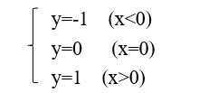
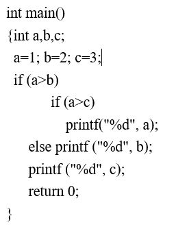
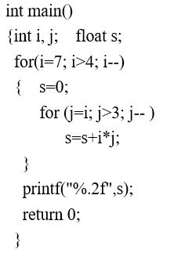
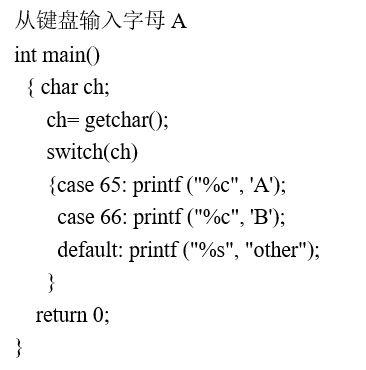
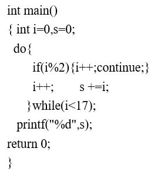
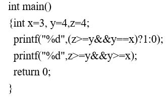
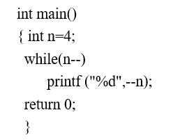
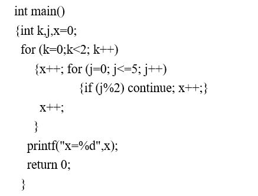
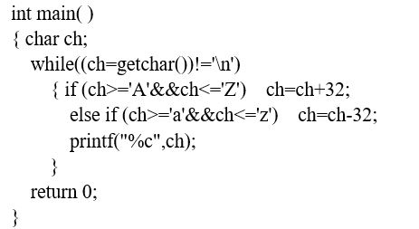

# exam4
客观题、填空题及程序填空题参考答案在 [ANSWERS.md](ANSWERS.md) 中，编程题参考答案为同目录下的 `.c` 文件。

<!-- TOC -->

- [客观题](#客观题)
- [填空题](#填空题)
- [程序填空题](#程序填空题)
- [编程题](#编程题)
  - [P1 整数序列的最大跨度值](#p1-整数序列的最大跨度值)
  - [P2 计算分数的和](#p2-计算分数的和)
  - [P3 小明爬楼梯](#p3-小明爬楼梯)

<!-- /TOC -->

## 客观题
1. C语言源程序的是由()构成的。  
  A. 标识符  
  B. 运算符  
  C. 函数  
  D. 数据

2. 不能作为C语言常量的是()。  
  A. 0xA5  
  B. 2.5e-2  
  C. 3e2  
  D. 0582

3. 下面标识符中，可以用做变量名的是()。  
  A. day  
  B. 3AB  
  C. while  
  D. long

4. C语言中，运算符的操作数必须是 `int` 类型的运算是__。  
  A. %  
  B. /  
  C. --  
  D. ++

5. 已知 `int b=2;` 则表达式()的值等于 `1` 。  
  A. b>b  
  B. b!=b  
  C. !b||b  
  D. b==1

6. 执行下列语句后 `a` 的值为：  
  A. 2  
  B. 语法错误  
  C. 1  
  D. 0
```C++
int a,b,c;
a=b=c=1;
++a||++b&&++c;
```

7. 已知 `int a=4,b=5,c;` 则执行表达式 `c=a=a>b` 后，变量 `a` 的值为()。  
  A. 5  
  B. 4  
  C. 1  
  D. 0

8. 已知 `int x; float y;`  
所调用的scanf函数为： `scanf("x=%d,y=%f",&x,&y);`  
则为了将数据 `10` 和 `0.36` 分别赋给 `x` 和 `y` ,正确的输入应当是()。  
  A. x=10,y=0.36<回车>  
  B. 10,0.36<回车>  
  C. 10<回车>0.36<回车>  
  D. x=10<回车>,y=0.36<回车>

9. 设变量t为int型，下列选项中，不正确的赋值语句是()。  
  A. ++t;  
  B. n1=n2=n3=0;  
  C. k=i==1;  
  D. a=b+c+d=1;

10. 经过下述赋值后，变量x的数据类型是()  
  A. double  
  B. int  
  C. char  
  D. float
```C++
float x=21.0; int y;
y=(int)x;
```

11. 在 `while(x)` 语句中的 `x` 与下面条件表达式等价的是( )  
  A. x==0  
  B. x==1  
  C. x!=0  
  D. x!=1

12. 已知 `int x,a,b;` 则下列选项中错误的if语句是()  
  A. if (a=b) x++;  
  B. if (a=<b) x++;  
  C. if (a-b) x++;  
  D. if(x) x++;

13. 若有说明 `int x,y;` 不能实现以下函数关系的程序段是()  

```C++
//A选项
if (x<0) y=-1;
else if(x==0)
y=0;
else y=1;

//B选项
y= 1;
if (x!=0)
if (x>0) y=1;
else y=0;

//C选项
y=0;
if (x>=0)
{ if (x>0) y=1;}
else y=-1;

//D选项
if (x>=0)
if(x>0) y=1;
else y=0:
else y=-1;
```

14. C语言合法的字符常数是()  
  A. '65'  
  B. "\n"  
  C. '\0'  
  D. "65"


15. 以下程序段中，while循环的循环次数是()  
  A. 9  
  B. 8  
  C. 10  
  D. 无数次
```C++
int i=0;
while(i<10)
{ if(i<1) continue;
if(i==5) break;
i++;
}
```

16. 以下程序段的输出结果是()  
  A. 3  
  B. 4  
  C. 5  
  D. 6
```C++
int x=5;
if(x--<5)
printf("%d",x);
else
printf("%d",x++);
```

17. 下列程序是求1~100的累加和，其中有3个能够完成规定的功能;有1个所完成的功能与其他程序不同，它是()
```C++
//A选项
s=0; i=0;
while (i<=100)
s+=i++;

//B选项
s=0; i=1;
while (i++<100)
s+=i;

//C选项
s=0; i=0;
while (i<100)
s+= ++i;

//D选项
s=0; i=0;
while (++i<=100)
s+=i;
```

18. 以下语句，()不正确。  
  A. printf("\n");  
  B. printf('\n');  
  C. printf("%%n");  
  D. printf("\n");

19. 若有定义语句: `int k1=9,k2=10;`  
执行表达式 `(k1=k1>k2) && (k2=k2>k1)` 后， `k1` 和 `k2` 的值分别为()  
  A. 0,1  
  B. 0,10  
  C. 9,10  
  D. 9,1

20. 程序的三种基本结构不包括()  
  A. 顺序结构  
  B. 选择结构  
  C. 交叉结构  
  D. 循环结构

## 填空题
1. 读程序.写出以下程序的输出结果。  


2. 读以下程序或程序段，写出执行结果。  


3. 读以下程序或程序段，写出执行结果。  


4. 读以下程序或程序段，写出执行结果。  


5. 读以下程序或程序段，写出执行结果。  


6. 读以下程序或程序段，写出执行结果。  


7. 读以下程序或程序段，写出执行结果。  


8. 读以下程序,如果从键盘上输入ABCdef后回车，执行结果是  


9. 读程序.如果执行时输入STUdent回车，则程序执行结果是
```C++
main()
{char ch;
 while((ch=getchar())!='\n')
   { if (ch>='A' && ch<='Z')  ch=ch+32;
     if (ch>='a' && ch<='z')  ch=ch-32;
     printf("%c",ch);
   }
  printf("\n");
 }
```

10. 读程序.运行下面程序时,给变量a输入15,则输出结果是()
```C++
int main()
{
   int a,b;
   scanf("%d",&a);
   b=a>15?a+10:a-10;
   printf("%d\n",b) ;
   return 0;
}
```

## 程序填空题
1. 华氏温度和摄氏温度的转换公式为C=5/9 × (F-32)，其中C表示摄氏温度，F表示华氏温度。要求输出从华氏0°到华氏300°，每隔20°输出一个对应的摄氏温度值。
```C++
#include <stdio.h>
int main()
 {  int upper, step;
    float fahr=0, celsius;
    upper=300; step=20;
    while(fahr<=upper)
    { 
      ____1____;
      printf ("%.0f,%6.2f\n", fahr, celsius);
      ____2____;
    }
    return 0;
 }
```

2. 输出3-100之间的所有素数
```C++
#include <stdio.h>
#include<math.h>
int main()
 { int i, j;
  for(i=3; i<=100; i++)
  { for (j=2; j<=____1____; j++)
        if(____2____) break;
    if(____3____)
        printf ("%4d",i);
   }
   return 0;
}
```

3. 一个正整数，如果它能被n整除，或者它的十进制表示法中某个数位上的数字为n，则称其为与n相关的数。现求所有小于等于 m(m<100) 的与n无关的正整数的平方和。 n不为0. 例如21与2有关、与7有关。  
输入数据: 输入为一正整数m,(m<100)和个位整数n  
输出数据: 输出小于等于m的与n无关的正整数的平方和  
输入示例: `21 7`  
输出示例: `2336`
```C++
#include<stdio.h>
int main()
{
    int m,n,i;
    int sum;
    scanf("%d %d",&m,&n);
    ____1____
    for(i=1; i<=m; i++)
    {     if(____2____)
		        continue;
        ____3____;
    }
    printf("%d\n",sum);
    return 0;
}
```

4. 计算分数序列1/2, 2/3,3/5,5/8,8/13,13/21,......前30项的和。
```C++
#include <stdio.h>
int main( )
{int a,b,c,i; double t,sum=0.0;         
 a=2; b=1;
 for(i=0; i<____1____; i++)
  {t=____2____;
   sum+=t;
    ____3____
  }
 printf("sum=%.2f\n",sum);
 return 0;
}
```

5. 输入一个整数n和一个字符c,输出倒三角图案，图案总共n行,1≤n≤20。  
输入数据:一个整数  
输出数据: 倒三角图案  

输入示例:
```
5*
```
输出示例:
```
*********
 *******
  *****
   ***
    *
```
```C++
#include <stdio.h>
int main()
{int k,i,j,n;
 char c;
 scanf(____1____);
 for (i=1; i<=n; i++)
   { for (j=1; j<____2____; j++) putchar(' ');
     for (j=1; j<=____3____; j++) putchar(c);
     putchar('\n');
   }
return 0;
}
```

6. 与数学式子3乘以√​x除以(2x-1)对应的C语言表达式是____1____

## 编程题

### P1 整数序列的最大跨度值
给定一个长度为n的非负整数序列，请计算序列的最大跨度值（最大跨度值 = 最大值减去最小值）

输入格式:  
一共2行，第一行为序列的个数n（1 <= n <= 1000)，第二行为序列的n个不超过1000的非负整数，整数之间以一个空格分隔。

输出格式:  
输出一行，表示序列的最大跨度值。

输入样例:
```
6
3 0 8 7 5 9
```
输出样例:
```
9
```
### P2 计算分数的和
输入两个分数，计算它们的和，并以最简分式的方式输出。

输入格式:  
输入共2行，每行以分子/分母的形式输入一个分数。

输出格式:  
输出共一行，以分子/分母形式给出两个分数相加的和。

输入样例1:
```
7/3
2/3
```
输出样例1:
```
3
```
输入样例2:
```
9/7
5/6
```
输出样例2:
```
89/42
```

### P3 小明爬楼梯
讲解视频:  
https://www.bilibili.com/video/BV1GE41137BU

小明特别喜欢爬楼梯，他有的时候一次爬一个台阶，有的时候一次爬两个台阶，有的时候一次爬三个台阶。如果这个楼梯有n个台阶，小明一共有多少种爬法。

输入格式:  
输入在一行中给出整数n。1≤n≤50

输出格式:  
在一行中输出爬法。

输入样例:
```
4
```

输出样例:
```
7
```