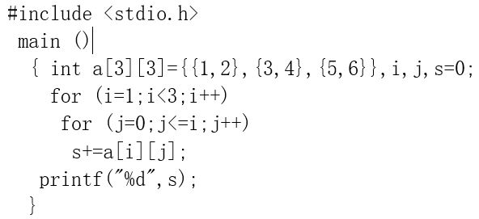
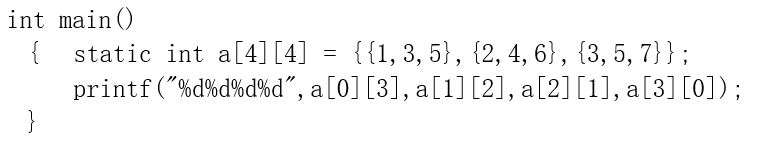
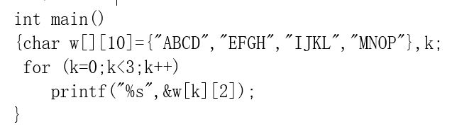
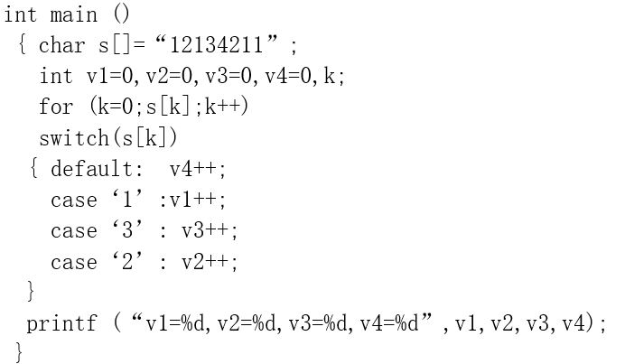
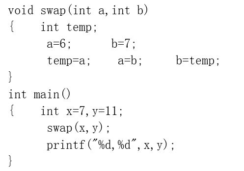
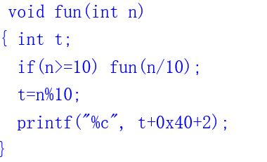
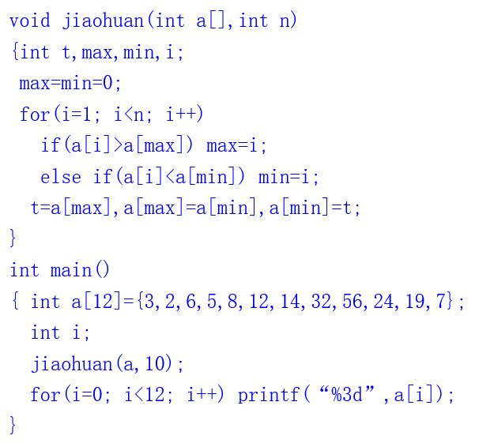
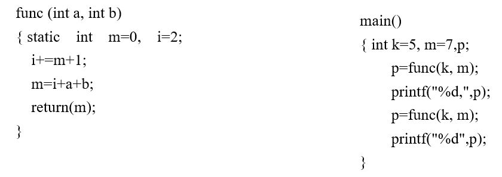
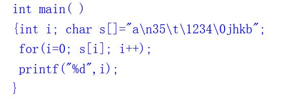
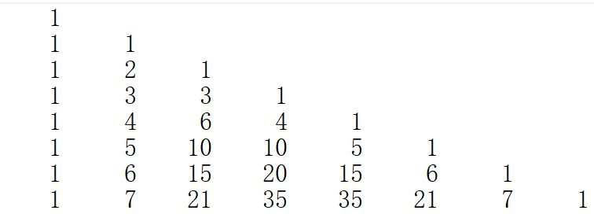

# exam5
客观题、填空题、程序填空题及函数题参考答案在 [ANSWERS.md](ANSWERS.md) 中，编程题参考答案为同目录下的 `.c` 文件。

<!-- TOC -->

- [客观题](#客观题)
- [填空题](#填空题)
- [程序填空题](#程序填空题)
- [函数题](#函数题)
  - [成绩好的课程](#成绩好的课程)
- [编程题](#编程题)
  - [P1 判断两个字符串是否为变位词](#p1-判断两个字符串是否为变位词)
  - [P2 单词首字母大写](#p2-单词首字母大写)

<!-- /TOC -->

## 客观题
1. 若有说明: `int a[3][4];` 则对a数组元素的正确引用是()  
 A. `a[2][4]`  
 B. `a[2,3]`  
 C. `a[1+1][0]`  
 D. `a(2)(3)`

2. 下面关于字符串的说明中，错误的是()  
 A. `char str1[ ]="FORTRAN";`  
 B. `char str[20]="FORTRAN";`  
 C. `char str[ ]={'F','O','R','T','R','A','N','\0'};`  
 D. `char str1[7]="FORTRAN";`

3. 以下能对二维数组a进行正确初始化的语句是()  
  A. `int a[2][ ]={{1,0,1},{5,2,3}};`  
  B. `int a[ ][3]={{1,2,3},{4,5,6,4}};`  
  C. `int a[ ][3]={{1,0,1},{3 },{1,1}};`  
  D. `int a[2][4]={{1,2,3},{4,5},{6}};`

4. 定义 `int a[5][6];` 后，数组a的第0个元素是 `a[0][0]` , 第12个元素是()  
  A. `a[1][5]`  
  B. `a[2][0]`  
  C. `a[2][1]`  
  D. `a[3][0]`

5. 有 `char a[80],b[80];` 则正确的输出语句是()  
  A. `puts(a) ; puts(b);`  
  B. `printf("%s,%s",a[ ],b[ ]);`  
  C. `putchar(a,b);`  
  D. `puts(a,b);`

6. 为了判断两个字符串s1和s2是否相等，应当使用()  
  A. `if(s1==s2)`  
  B. `if(sl=s2)`  
  C. `if(strcpy(s1,s2))`  
  D. `if(strcmp(s1,s2)==0)`

7. 以下叙述中正确的是()  
  A. 全局变量的作用域一定比局部变量的作用域范围大  
  B. 未在定义语句中赋初值的auto变量和static变量的初值都是随机值  
  C. 主函数里定义的变量是全局变量  
  D. 静态(static)类别变量的生存期贯穿于整个程序的运行期间

8. 若调用函数的实参是一个数组名，则向被调用函数传送的是()  
  A. 数组的长度  
  B. 数组的首地址  
  C. 数组每个元素的地址  
  D. 数组每个元素中的值

9. C语言程序由函数组成, ()  
  A. 主函数可以写在其它函数之后，函数内不可以嵌套定义函数  
  B. 主函数可以写在其它函数之后，函数内可以嵌套定义函数  
  C. 主函数必须写在其它函数之前，函数内可以嵌套定义函数  
  D. 主函数必须写在其它函数之前，函数内不可以嵌套定义函数

10. 以下描述正确的是()  
  A. 程序总是从main函数开始执行  
  B. C语言程序总是从第一个定义的函数开始执行  
  C. C语言程序中，要调用的函数必须在main函数中定义  
  D. main函数必须放在程序的开始部分

11. 若有定义和语句: `int *p,a;  p=&a;` 则*p表示的是()  
  A. 变量a的地址  
  B. 变量a的值  
  C. 变量p的值  
  D. 变量p的地址

12. 若有程序段 `int *p,a=5;p=&a;` 则下列选项中均代表地址的是()  
  A. `a,p,*&a`  
  B. `&*a,&a,*p`  
  C. `*&p,*p,&a`  
  D. `&a,&*p,p`

13. 若有定义 `int a[10]={1,2,3,4,5,6,7,8,9,10},*p;` 则下列语句正确的是()  
  A. `for(p=a;a<p+10;a++)`  
  B. `for(p=a;p<(a+10);p++)`  
  C. `for(p=a,a=a+10;p<a;p++)`  
  D. `for(p=a;p<a+10;++a)`

14. 下列程序段运行后a的值是()  
  A. `2`  
  B. `3`  
  C. `4`  
  D. `8`
```C++
int a,b[]={1,2,3,4,5,6,7,8,9,10};
int *p1=&b[5];
a=p1[2];
```

15. 已有以下数组定义和f函数调用语句，则在f函数的说明中，对形参数组array的正确定义方式为()  
  A. `f(int array[ ][4]);`  
  B. `f(int array[3][ ]);`  
  C. `f(int array[12]);`  
  D. `f(int array[ ][6]);`  
```C++
int a[3][4]; f(a);
```

16. 有以下函数定义: `void fun(int n,double x)  {……}`
若以下选项中的变量都已正确定义并赋值，则对函数fun的正确调用语句是()  
  A. `k=fun(10,12.5);`  
  B. `void fun(n,x);`  
  C. `fun(12,12.5);`  
  D. `fun(int y,double m);`

17. 已知 `char *p, *q;` 有实际意义的语句是()  
  A. `p*=3;`  
  B. `p/=q;`  
  C. `p+=3;`  
  D. `p+=q;`

18. 已知 `char s[20]= "programming",*ps=s;` 则不能引用字母o的表达式是()  
  A. `s[2]`  
  B. `ps+2`  
  C. `ps[2]`  
  D. `ps+=2, *ps`

19. 函数调用时,实参和形参都是简单变量，它们之间数据传递的过程描述正确的是()  
  A. 实参将值传递给形参，调用结束时形参并不将其值回传给实参  
  B. 实参将地址传递给形参，调用结束时形参再将此地址回传给实参  
  C. 实参将地址传递给形参，并释放原先占用的存储单元  
  D. 实参将值传递给形参，调用结束时形参再将其值回传给实参

20. 在C语言中，二维数组中的元素在内存中的存放顺序是()  
  A. 按行存放  
  B. 按列存放  
  C. 由编译器决定  
  D. 由用户自己定义

## 填空题
1. 写出以下程序的输出结果  


2. 写出以下程序的输出结果  


3. 写出以下程序的输出结果  


4. 写出以下程序的输出结果  


5. 写出以下程序的输出结果  


6. 写出以下程序的输出结果  


7. 写出以下程序的输出结果  


8. 写出以下程序的输出结果  


9. 写出以下程序的输出结果  


10. 写出以下程序的输出结果  


## 程序填空题
1. 帕斯卡三角也叫杨辉三角。本题目要求打印帕斯卡三角的前N行。N<20.

```C++
#include <stdio.h>
int main()
{int a[20][20]={0};
 int i,j,n;
 scanf("%d",&n);
 for(i=0;i<n;i++)
     ____1____
 for(i=2;i<n;i++)
     for(j=1;j<i; j++)
         a[i][j]=____2____;
 for(i=0;i<n; i++)
 {for(j=0;____3____; j++)
         printf("%6d",a[i][j]);
  printf("\n");
 }
 return 0;
}
```

2. 以下函数实现把字符串s1、s2的连接到s3中。
```C++
#define MAX 50
int Myfunc(char s1[],char s2[], char s3[] )
{ 	int i,j;
	for(i=0; s1[i]; i++)
	    ____1____;
	j=0;
	while(____2____)
	   {
        ____3____;
	      j++;
	   }
	   ____4____;
}
```

3. 写一个递归函数，计算两个正整数的最大公因子。
```C++
#include <stdio.h>
int gongyinzi(int x,int y)
{
    if(x%y==0) ____1____;
    else return ____2____;
}
```

4. 从键盘上输入一个班(不到30人)学生某门课的成绩，当输入成绩为负时输入结束。
① 统计不及格人数并输出不及格学生的编号(从1开始); ② 统计并输出各分数段学生的人数及所占的比例。

```C++
#include <stdio.h>
#define N 30
int main()
{  int score[N];
   int a[11]={0};
   int i,count,k;
   ____1____;
    do{
        i++;
        scanf("%d",&score[i]);
    }while(score[i]>0);
    count=0;
    for(k=0; k<i; k++)
    {    a[____2____]++;
         if(score[k]<60)
	{
            ____3____;
            printf("number %d is failed\n",k+1);
        }
    }
    printf("there are %d failed\n",count);
    printf("100-90:%d\n",a[10]+a[9]);
    printf("80-89:%d\n",a[8]);
    printf("70-79:%d\n",a[7]);
    printf("60-69:%d\n",a[6]);
    printf("0-59:%d\n",a[5]+a[4]+a[3]+a[2]+a[1]);
    return 0;
}
```

5. 本题目要求往一个有序数组中插入5个数，插入后仍然有序。
```C++
#include <stdio.h>
#define N 20
main( )
{int a[N]={1,3,5,7,9,11,13,30},i,x,j,k=7;
 int *p;
 for(j=0; j<5; j++)
 {  scanf("%d",&x);
    for(p=a+k ; ____1____)
        if (*p>x)  ____2____;
        else break;
    ____3____;
    k++;
 }
 for(i=0; i<=k; i++)
    printf("%3d",a[i]);
 return 0;
}
```

## 函数题

### 成绩好的课程
一个班有6个学生，8门课程。本题要求实现一个函数，找出全部成绩在85分以上的课程（结果为1-8）。

函数接口定义:
```C++
void find(int a[][N],int x);
//其中 a 和 x 都是用户传入的参数, 函数 find 输出全部成绩在x上的课程
```
裁判测试程序样例:
```C++
#include <stdio.h>
void find(int a[][N],int x);
int main()
{int score[M][N];
 int i,j;
 for (i=0; i<M; i++)       //输入M个学生N门课的成绩
   for (j=0; j<N; j++)
     scanf("%d",&score[i][j]);
 find(score,85);           //输出全部成绩在85分以上的课程
 return 0;
}
/* 你的程序嵌在这里 */
```
输入样例:
```
90 95 97 97 91 82 70 98
84 83 65 62 92 78 75 90
70 66 95 85 88 85 60 97
60 87 86 96 89 68 84 93
71 67 82 63 85 100 67 97
100 99 96 89 86 89 65 86
```
输出样例:
```
5
8
```

## 编程题

### P1 判断两个字符串是否为变位词
如果一个字符串是 另一个字符串的重新排列组合，那么这两个字符串互为变位词。比如，”heart”与”earth”互为变位 词，”Mary”与”arMy”也互为变位词。

输入格式:  
第一行输入第一个字符串，第二行输入第二个字符串。

输出格式:  
输出“yes”,表示是互换词，输出“no”,表示不是互换词。

输入样例1:
```
Mary
arMy
```
输出样例1:
```
yes
```
输入样例2:
```
hello 114
114 hello
```
输出样例2:
```
yes
```
输入样例3:
```
Wellcom
mocllew
```
输出样例3:
```
no
```

### P2 单词首字母大写
本题目要求编写程序，输入一行字符，将每个单词的首字母改为大写后输出。所谓“单词”是指连续不含空格的字符串，各单词之间用空格分隔，空格数可以是多个。

输入格式:
输入给出一行字符。

输出格式:
在一行中输出已输入的字符，其中所有单词的首字母已改为大写。

输入样例:
```
How are you?
```
输出样例:
```
How Are You?
```