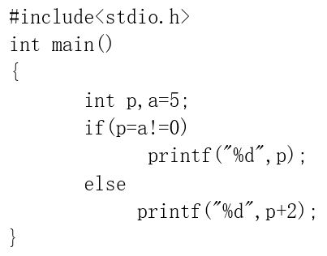
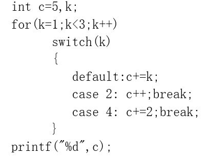
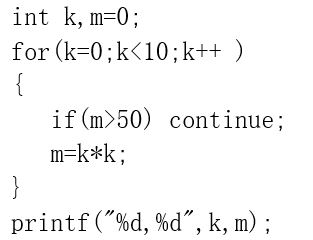
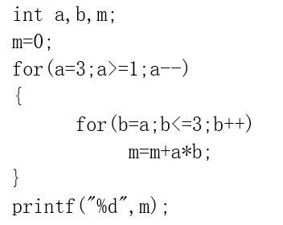
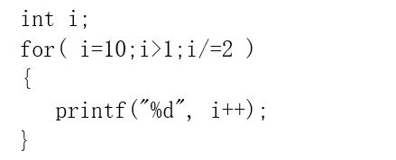
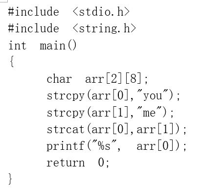
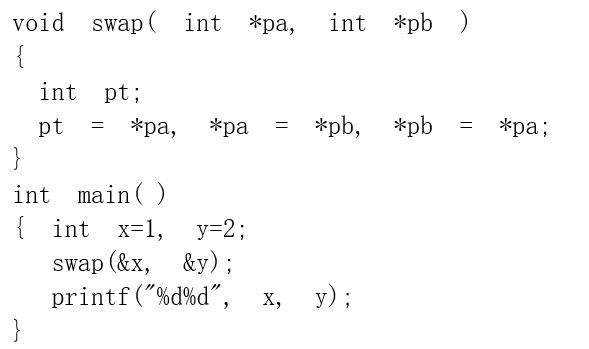
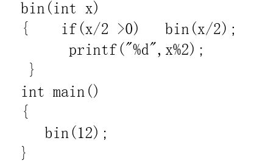
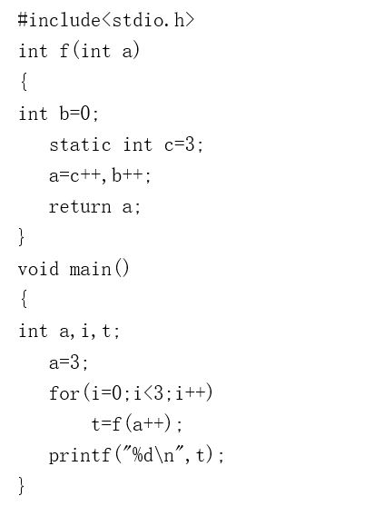

# exam6
客观题、填空题、程序填空题及函数题参考答案在 [ANSWERS.md](ANSWERS.md) 中，编程题参考答案为同目录下的 `.c` 文件。

<!-- TOC -->

- [客观题](#客观题)
- [填空题](#填空题)
- [程序填空题](#程序填空题)
- [函数题](#函数题)
- [编程题](#编程题)
  - [P1 特征数](#p1-特征数)
  - [P2 姓名统计](#p2-姓名统计)

<!-- /TOC -->

## 客观题

1. 将字符 `g` (字符 `a` 的ASCII码为 `97` )赋给字符变量 `c` ，正确的表达式是()  
  A. `c="g"`  
  B. `c=101`  
  C. `c='\147'`  
  D. `c='0147'`

2. 设有 `double x;` 正确的输入语句是()  
  A. `scanf("%ld",&x);`  
  B. `scanf("%f",&x);`  
  C. `scanf("%hf",&x);`  
  D. `scanf("%lf",&x);`

3. 设a为整型变量，不能正确表达数学关系 `10<a<15` 的C语言表达式是()  
  A. `a==11||a==12||a==13||a==14`  
  B. `a>10&&a<15`  
  C. `10<a<15`  
  D. `!(a<=10)&&!(a>=15)`

4. 下面()语句正确地描述了计算公式  
    
  A. `y = ax*x*x/(x – b);`  
  B. `y = (a*x*x*x)/(x – b);`  
  C. `y = a*x*x*x/x – b;`  
  D. `y = ax*x*x/x – b;`

5. 若已定义 `int a;` 则表达式 `a=10,a+10,a++` 的值是()  
  A. `10`  
  B. `20`  
  C. `21`  
  D. `11`

6. 下列符合C语法的if语句是()  
  A. `if 3>5 then printf("Ok!");`  
  B. `if(3>5) then printf("Ok!");`  
  C. `if(3>5) printf("Ok!");`  
  D. `if 3>5 printf("Ok!")`

7. 对于for语句 `for(x=1,y=10;(y>0)&&(x<4);x++,y--)` 以下说法正确的是()  
  A. 循环执行3次  
  B. 是无限循环  
  C. 循环执行4次  
  D. 循环次数无法确定

8. 下列各C语言程序段中不会构成死循环的是()  
```C++
//A选项
int x=10;
while(x=5 );

//B选项
int x;
for(x=0;x<10; x++)x--;

//C选项
int x=10;
while(x ); 
--x ;

//D选项
int x=100;
do{ ++x;}
while (x>=1000);
```

9. 有以下程序，程序运行后的输出结果是()  
  A. `Morning`  
  B. `Evening`  
  C. `Night`  
  D. `Afternoon`
```C++
main( )
{ char a[][10] = {"Morning","Afternoon","Evening", "Night"};
   printf("%s\n",a[1]);
}
```

10. 给定以下原型和变量定义，函数调用()不正确  
  A. `f(&a);`  
  B. `f(a);`  
  C. `f(1);`  
  D. `f(sizeof(a));`
```C++
void f(double dd);
double a;
```

11. 以下叙述中错误的是()  
  A. 函数形参是存储类型为自动类型的局部变量  
  B. 若 `static int x;` 则 `x` 会被初始化为0  
  C.函数中定义的变量默认是自动变量  
  D 全局变量的存储类别是 `auto` 型的

12. C程序中各函数之间可通过多种方式传递数据,下列不能实现数据传递的方式是()  
  A. 全局变量  
  B. 函数返回值  
  C. 同名的局部变量  
  D. 参数的形实结合

13. 若调用函数的实参是一个数组名，则向被调用函数传送的是()  
  A. 数组的长度  
  B. 数组的首地址  
  C. 数组每个元素的地址  
  D. 数组每个元素的值

14. 如果有如下定义，则表达式()的结果为假  
  A. `p == a[0]`  
  B. `p == &a[0]`  
  C. `*p == a[0]`  
  D. `p[0] == a[0]`
```C++
int a[ ] = {0};
int *p = a;
```

15. 申请一个具有n个int型元素的一维动态数组，可以使用语句()  
```C++
//A选项
int *p;
p=(int *)malloc(n,sizeof(int));

//B选项
int *p;
p=(int *)malloc(n*sizeof(int));

//C选项
int *p;
p=(int *)malloc(sizeof(int))*n;

//D选项
int p[n];
```
16. 若有定义int a[2][3]；则a数组的第j行第k列（假设j,k已正确说明并赋植）元素的地址为()  
  A. `*(a[j]+k)`  
  B. `*(a+j)`  
  C. `*(a+k)`  
  D. `*(a+j)+k`

17. 说明语句 `void *f();` 的含义是()  
A. 函数f的返回值是一个通用型的指针  
B. 函数f的返回值可以是任意的数据类型  
C. 函数f没有返回值  
D. 指针f指向一个函数，该函数无返回值

18. 设有如下定义，若变量均已正确赋值，则以下语句中错误的是()  
  A. `t1=t2;`  
  B. `t2.num1=t1.num1;`  
  C. `t2.mark=t1.mark;`  
  D. `t2.num2=t1.num2;`
```C++
struct 
{  char mark[12];
   int num1;
   double num2;
}t1,t2;
```

19. 若有下列定义，则能正确定义结构体数组并赋初值的语句是()  
A. `STD tt[2]={{1,'A',62},{2,'B',75}};`  
B. `STD tt[2]={1,"A",62,2,"B",75};`  
C. `struct tt[2]={{1,'A'},{2,'B'}};`  
D. `struct tt[2]={{1, "A",62.5},{2, "A",75.0}};`
```C++
typedef  struct
{ int n; char c;  double x;}STD;
```

20. 要对某二进制文件追加数据，则正确的打开操作是()  
  A. `"a"`  
  B. `"ab"`  
  C. `"rb"`  
  D. `"wb"`

## 填空题

1. 写出以下程序的输出结果  


2. 写出以下程序的输出结果  


3. 写出以下程序的输出结果  


4. 写出以下程序的输出结果  


5. 写出以下程序的输出结果  


6. 写出以下程序的输出结果  


7. 写出以下程序的输出结果  


8. 写出以下程序的输出结果  


9. 写出以下程序的输出结果  


10. 写出以下程序的输出结果  


## 程序填空题
1. 所谓“水仙花数”，是指一个三位数，其各位数字的立方和等于该数本身。例如， `153` 是“水仙花数”，因为 `1³+5³+3³=153` 。本题目要求打印所有的水仙花数。
```C++
#include <stdio.h>
int main()
{
    int i, j, k, n;
    printf("result is:");
    for (n=100; n<1000; n++)
    {
        i = n / 100;
        j = ____1____;
        k = ____2____;
        if (____3____)
        {
            printf("%4d",n); 
        }
    }
    printf("\n");
    return 0;
}
```

2. 本题目要求完善 `turn` 函数，实现字符串的逆置。
```C++
void turn(char s[])
{   int len,i;
    char t;
    ____1____;
    for(i=0;i<____2____; i++)
    { t=s[i]; ____3____ }
}
```

3. 输入三条边的长，输出这三条边是否构成等边三角形、直角三角形、普通三角形，还是不能构成三角形。
```C++
int main( ) {
    int a,b,c;
    scanf("%d%d%d",&a,&b,&c);
    if(____1____)
      if(____2____) printf("等边三角形\n");
      else if(____3____) printf("直角三角形\n");
           else printf("普通三角形\n");
    else printf("不构成三角形\n");
    return 0;
}
```

4. 输入一行字符和一个整数n，输出其中第n个字符(n≥1)。本题利用链表存放输入的一行字符。 例如输入 `abc` 和 `1` ，输出 `a` 。
```C++
#include "stdio.h"
#include "stdlib.h"
#define LEN sizeof(struct onechar)
struct onechar           //结点结构
{char c;
 struct onechar  *next;
};
int n;
struct onechar *creat()   //建立链表，返回头指针
{struct onechar *head,*p1,*p2;
 int i;
 char s[80];
 gets(s);
 head=NULL;
 for(i=0; s[i]; i++)
 {p1=(struct onechar *)malloc(LEN);
  p1->c=s[i];
  if(i==0) head=p1;
  else p2->next=p1;
  p2=p1;
 }
 if(i) p2->next=NULL;
 return(head);
}
char print(struct onechar *head,int k)    //输出链表
{struct onechar *p;
 int num;
 p=head; num=1;
 while (____1____)
    {num++;
     ____2____;      
    }
 if(p)  return  ____3____;
 else return '\0';
}
int main()
{struct onechar *head;
 int s;
 char c;
 head=creat();
 scanf("%d",&s);
 c=print(head,s);
 if(!c) printf("没有这个字符\n");
 else printf("%c\n",c);
 return 0;
}
```

5. 输入12个学生的信息，包括姓名、生日、电话号码，本程序输出年龄最大的学生姓名。题目保证所有人的生日均不相同。  
输入共12行，每行按照 `姓名 生日 电话号码` 的格式给出一位学生的信息，其中“姓名”是长度不超过8的英文字母组成的字符串，“生日”是 `yyyymmdd` 格式的日期，“电话号码”是不超过17位的数字及+、-组成的字符串。  
输出只有一行，是年龄最大的学生姓名

```C++
#include <stdio.h>
struct date
{int year,month,day;
};
struct stu
{ char name[9];
  struct date bir;
  char telephone[18];
};
int cmp(struct date d1,struct date d2)
{
  if(d1.year<d2.year) return 1;
  if(d1.year==d2.year&&d1.month<d2.month) return 1;
  if(d1.year==d2.year&&d1.month==d2.month&&d1.day<d2.day) return 1;
  return 0;
}
int main( )
{   struct stu a[12],t;
    int i,j;
    for(i=0; i<12; i++)
        scanf(" %s %4d%2d%2d %s",____1____);
    t=a[0];
    for(i=0; i<12; i++)
        if(cmp(a[i].bir,t.bir)==1)
           ____2____;
    printf("%s\n",____3____);
  return 0;
}
```

输入样例:
```
wang 19821020 +86-0571-88018448
qian 19840619 13609876543
Rose 19850321 800-810-8888
Lily 19860419 400-820-1668
Daisy 19880501 95187-1
Jasmine 19870101 010-62835678
Poppy 19840201 022-87729595
Violet 19821003 15733445566
Camellia 19831105 13011234567
Rosemary 19830227 +86-791-88444330
Daffodil 19821131 95254664
Gardenia 19830101 0453-5805928
```
输出样例:
```
Violet
```

## 函数题
本题要求实现一个函数，可以统计给定字符串中大写字母的个数。例如 `2020ABADE` 中，出现了 `5` 个大写字母，则该函数应该返回 `5` 。

函数接口定义:
```C++
int bch(char *p);
//其中 p 是用户传入的参数，不是字符串的首地址。
```
裁判测试程序样例:
```C++
#include <stdio.h>
int bch(char *p);
int main()
{
    char string[100];
    int num;
    gets(string);
    num=bch(string);
    printf("%d\n",num);
    return 0;    
}
/* 你写的函数将被嵌在这里 */
```
输入样例:
```
2020ABADE
```
输出样例:
```
5
```

## 编程题

### P1 特征数
编一程序，输出2到k之间的所有特征数。所谓特征数是指这样的数，它出现在它的平方的右侧，如5的平方是25，25的右端是5，25的平方是625，所以5、25是一个特征数。k<1000000。

输入格式:  
输入仅一行，输入1个整数k。

输出格式:  
输出多行，分行输出2到k之间的所有的特征数。包含k.

输入样例:
```
9
```
输出样例:
```
5
6
```

### P2 姓名统计
输入100个姓名（可能有相同的姓名），输出一共出现了多少种姓名。

输入格式:  
输入100行字符串。

输出格式:  
输出一个整数。

输入样例（以5行为例）:
```
zhang
li
wang
li
zhang
```
输出样例:
```
3
```